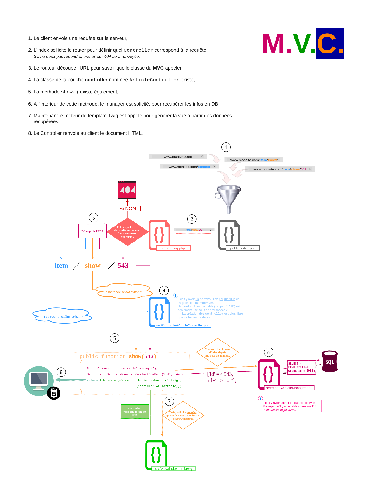

<h1>Life On Mars (Hackathon 1, WCS Web PHP)</h1>

### Create a website with "themed of social networks on planet mars" by php


---

## Simple MVC

### Description

This repository is a simple PHP MVC structure from scratch.

It uses some cool vendors/libraries such as Twig and Grumphp.
For this one, just a simple example where users can choose one of their databases and see tables in it.

### Steps

0. Clone the repo from GitHub : `git clone git@github.com:jaldabaoth-code/Life-On-Mars.git`
0. Enter the directory : `cd Life-On-Mars`
0. Run `composer install`
0. Create a database (e.g. named `life_on_mars`) : `create database database_name;`
0. Create <b>*config/db.php*</b> from <b>*config/db.php.dist*</b> file and add your DB parameters<br/>
    Don't delete the <b>*.dist*</b> file, it must be kept
    ```php
    define('APP_DB_HOST', 'your_db_host');
    define('APP_DB_NAME', 'your_db_name');
    define('APP_DB_USER', 'your_db_user_wich_is_not_root');
    define('APP_DB_PASSWORD', 'your_db_password');
    ```
0. Import the last version of the <b>*dataVx.sql*</b> file in your SQL server, you can do it manually or use the *migration.php* script which will import a <b>*dataVx.sql*</b> file.
0. Run the internal PHP webserver with `php -S localhost:8000 -t public/`. The option `-t` with `public` as parameter means your localhost will target the `/public` folder.
0. Go to <b>localhost:8000</b> with your favorite browser.
0. From this starter kit, create your own web application.

#### Windows Users

If you develop on Windows, you should edit you git configuration to change your end of line rules with this command :

`git config --global core.autocrlf true`

### Example 

An example (a basic list of items) is provided (you can load the *simple-mvc.sql* file in a test database). The accessible URLs are :

* Home page at [localhost:8000/](localhost:8000/)
* Items list at [localhost:8000/items](localhost:8000/items)
* Item details [localhost:8000/items/show?id=:id](localhost:8000/item/show?id=2)
* Item edit [localhost:8000/items/edit?id=:id](localhost:8000/items/edit?id=2)
* Item add [localhost:8000/items/add](localhost:8000/items/add)
* Item deletion [localhost:8000/items/delete?id=:id](localhost:8000/items/delete?id=2)

You can find all these routes declared in the file `src/routes.php`. This is the very same file where you'll add your own new routes to the application.

### How does URL routing work ?



### Ask for a tour !


We prepare a little guided tour to start with the simple-MVC.

To take it, you need to install the `Code Tour` extension for Visual Studio Code : [Code Tour](https://marketplace.visualstudio.com/items?itemName=vsls-contrib.codetour)

It will give access to a new menu on your IDE where you'll find the different tours about the simple-MVC. Click on play to start one : 


### Run it on docker

If you don't know what is docker, skip this chapter. ;) 

Otherwise, you probably see, this project is ready to use with docker. 

To build the image, go into the project directory and in your CLI type:

```
docker build -t simple-mvc-container .
```

then, run it to open it on your localhot :

```
docker run -i -t --name simple-mvc  -p 80:80 simple-mvc-container
```

### Authors

* [Lochlainn Gadault](https://github.com/wonecode)
* [Zurabi Grialat](https://github.com/jaldabaoth-code)
* [Raphaël Billet Servoin](https://github.com/RaphaelBS-WCS)
* [Julien Moineau](https://github.com/JuMn88)
* [Maxime Giraudeau](https://github.com/Wowlfy)

---

## The Links

<a href="https://github.com/wonecode/Hackathon-1-WCS">Link to the repository of project where we worked <b>WCS Web Hackathon 1</b></a>

<a href="https://github.com/WildCodeSchool/simple-mvc">Link to the repository of <b>Simple-MVC</b></a>
